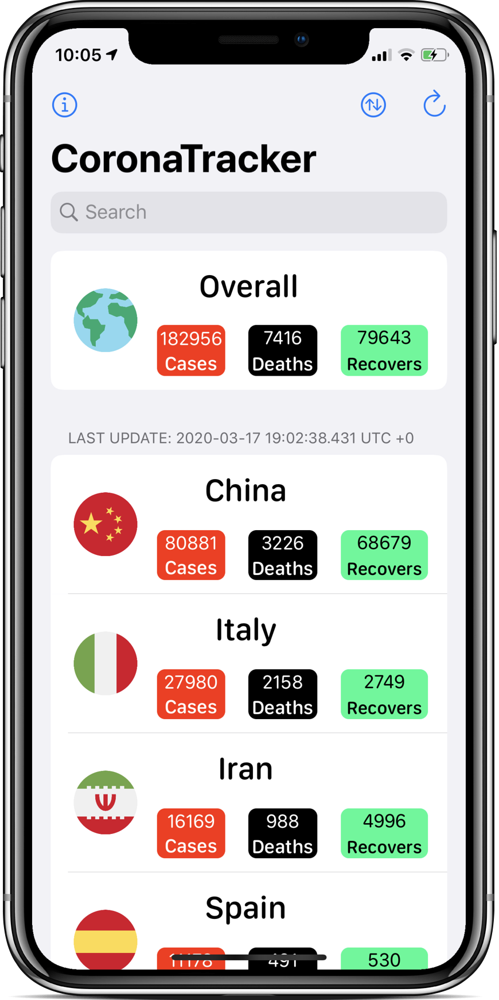
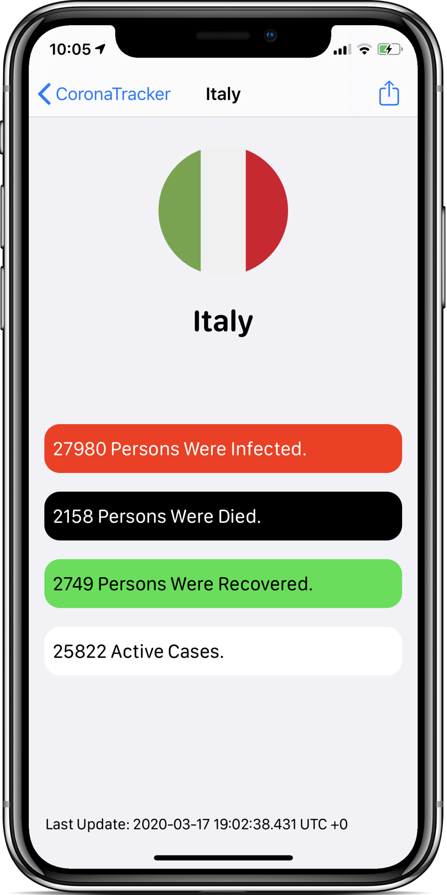

# CoronaTracker

CoronaTracker is a free, open-sourced, online app for tracking COVID-19 outbreak cases based on countries. All data of this app has provided by [interactive-static.scmp.com](https://interactive-static.scmp.com) and will be updated daily.

Apple won't approve any coronavirus-themed apps created by individual developers, so I open-sourced this app and you can install to your physical phone and use it.

</img>
</img>

## Features

- Shows Total cases, deaths, recovers active cases of each country on the home page and the detail page.
- Shows Total cases, deaths, recovers active cases of the world.
- Search for countries.
- Sorts the list by 7 different options.
- Update the data daily.
- Support Dark Mode.

**Requirements**:
- Internet connection.
- An iOS device running on iOS 13.0 or later.

## Using/Installing

**Requirements**:
- A device running on macOS.
- Xcode app.

To install CoronaTracker, clone this repository and open the CoronaTracker.xcodeproj file using Xcode. Change the bundle identifier to something different, then Build and Run the app to your device. 

No developer account required.

## Contribution

Feel free to report a bug if you noticed. I've spent a little time to create this app, it's possible if it has any bug.

You can contact me via Twitter [@M1bki0n.](https://twitter.com/M1bki0n)

I appreciate pulling requests or contributions to improving features or fix bugs of this app.

## Credits & License

CoronaTracker is entirely licensed under [Unlicense](Documentation/License), except the flags and built-in iOS icons.

The idea came from [Julian Schiavo](https://twitter.com/_julianschiavo) after he was made a related app. (Thanks, Julian!)
